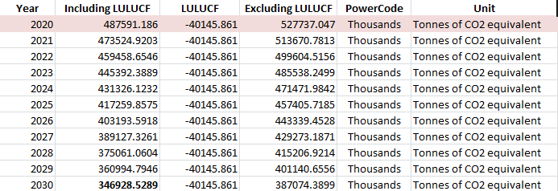
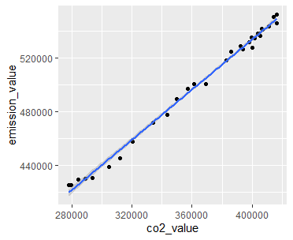
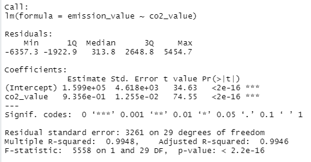

# Australia Greenhouse Gasses Analysis
This repository contains analysis of Greenhouse Gasses emission of Australia.

## Background
Australia has revised target of reducing emissions by 43 per cent below 2005 levels by 2030. Australia's quarterly emissions have fallen by 21% since 2005. Australia has reduced its emissions at a faster rate than many similar developed countries.  
Link: <a href="https://www.aofm.gov.au/sites/default/files/2022-11-28/Aust%20Govt%20CC%20Actions%20Update%20November%202022_1.pdf#:~:text=Australia%20has%20a%20revised%20target,below%202005%20levels%20by%202030.&text=Australia's%20quarterly%20emissions%20have%20fallen,than%20many%20similar%20developed%20countries">Prime Minister of Australia</a>

## Dataset
For this project, I use dataset of Greenhouse Gas Emissions from Organisation for Economic Co-operation and Development (OECD). Link to <a href="https://stats.oecd.org/Index.aspx?DataSetCode=air_ghg">dataset</a>.

## Tools
1. **Microsoft Excel** to load and transfor data.
2. **Microsoft Power BI** to create visualization.
3. **R** to create model dan predict value.

## Analysis
After analyzing data Australia GHG data, below are charts showing total emissions, LULUCF (Land Use, Land-Use Change and Forestry), and pollutants, from 1990 to 2020
  
</img>  
</img>  
</img>  
Based on analysis above, I will build **linear regression model** to predict the maximum amount of CO2 emission the country has to keep each year in order to achive the target GHG emission in 2030. As we know from the report, there are 6 gasses that contribute to total GHG emission, plus LULUCF factor. Among the 6 gasses, the main contributor is CO2. 

## GHG Emission
- First, calculate the target GHG emission for year 2030. It is 43% below emission in 2005. Hence, the emission value is 57% of 2005 emission (608646.542 thousands tonnes). 
  ` 2030 GHG emission = 57% * 608646.542 = 346928.5289 thousands tonnes `
- Calculate the difference between 2030 emission and 2020 emission (487591.186 thousands tonnes). 
  ` 487591.186 - 346928.5289 = 140662.66 thousands tonnes `
- From 2020 to 2030, there are 10 years interval i.e. 2021, 2022, ... 2030. So, I divide the difference value above with 10.
  ` 140662.66 / 10 = 14066.266 `
- For LULUCF value, I use constant value and it is same with the 2020 LULUCF value, ` -40145.861 thousands tonnes `, assuming that Australia Government is consistent to keep the forest area and green space in the country.
- Calculate the GHG emission excluding LULUCF, by substracting the GHG emission including LULUCF above with LULUCF value. Here are the complete values of GHG emission based on calculation above:

## Predicting CO2 Emission with R
After retrieving the values of GHG emission for 2021 to 2030, next step is building the linear regeression model with R to predict the CO2 emission for each of the years. This values are useful for all sectors to measure their CO2 emission limit in order to achieve the country's GHG emission target in 2030.

I use 3 libraries here:
- ` readxl ` to read Excel files,
- ` tidyverse ` for general analysis,
- ` chemCal ` to use ` inverse.predict() ` function, because here I will predict the CO2 values (x) based on GHG values (y).

Plot the CO2 and GHG emission (values in thousands tonnes): 
` ggplot(data = NULL, aes(x = co2_value, y = emission_value)) + geom_point() + geom_smooth(method = 'lm') `   
  
Based on plot above, we can seen that CO2 and GHG emission can be modeled with Linear Regression.

Calculate the correlation value between CO2 and GHG: 
` cor(emission_value, co2_value) `  
> 0.9974014

Build the linear regression model:
` emission_co2_model <- lm(emission_value ~ co2_value) `  
` summary(emission_co2_model) `  
  
From summary above, we can see that CO2 and GHG emission have strong positive correlation. The value is ` 9.356e-01 ` or ` 0.9356 `, and almost ` +1 `.

Next step, enter the values of GHG emission (without LULUCF) from table above, I assign them as ` ynew ` variable: 
` ynew <- c(513670.8, 499604.5, 485538.2, 471472, 457405.7, 443339.5, 429273.2, 415206.9, 401140.7, 387074.4) `

Predict the values of CO2, ` xpred ` variable, based on the GHG emission values above:  
` xpred <- t(sapply(ynew, function(y) inverse.predict(emission_co2_model, y)[1:3])) `

Here are the predicted CO2 values with 95% confidence interval for the next 10 years (2021 to 2030): 

